# ClinEdOps — Application Flow Diagrams

> A visual reference for the high-level architecture, user journeys, and feature workflows of the ClinEdOps platform.

---

## 1. System Architecture Overview

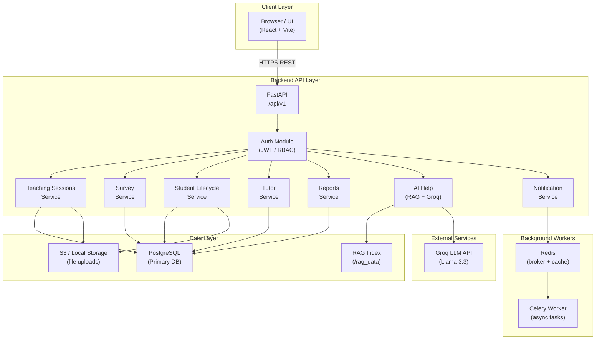
```mermaid
graph TB
    subgraph Client["Client Layer"]
        Browser["Browser / UI\n(React + Vite)"]
    end

    subgraph API["Backend API Layer"]
        Gateway["FastAPI\n/api/v1"]
        Auth["Auth Module\n(JWT / RBAC)"]
        Sessions["Teaching Sessions\nService"]
        Surveys["Survey\nService"]
        Students["Student Lifecycle\nService"]
        Tutors["Tutor\nService"]
        Reports["Reports\nService"]
        AIHelp["AI Help\n(RAG + Groq)"]
        Notifications["Notification\nService"]
    end

    subgraph Workers["Background Workers"]
        Celery["Celery Worker\n(async tasks)"]
        Redis["Redis\n(broker + cache)"]
    end

    subgraph Storage["Data Layer"]
        Postgres["PostgreSQL\n(Primary DB)"]
        S3["S3 / Local Storage\n(file uploads)"]
        RagIndex["RAG Index\n(/rag_data)"]
    end

    subgraph External["External Services"]
        Groq["Groq LLM API\n(Llama 3.3)"]
    end

    Browser -->|HTTPS REST| Gateway
    Gateway --> Auth
    Auth --> Sessions & Surveys & Students & Tutors & Reports & AIHelp & Notifications
    Sessions & Surveys & Students & Tutors & Reports --> Postgres
    Sessions & Students --> S3
    Notifications --> Redis --> Celery
    AIHelp --> RagIndex
    AIHelp --> Groq
```

---

## 2. User Role Access Map

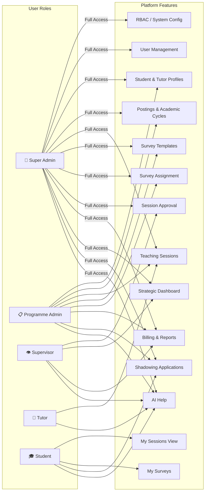
```mermaid
graph LR
    subgraph Roles["User Roles"]
        SA["🔐 Super Admin"]
        PA["📋 Programme Admin"]
        SV["👁️ Supervisor"]
        TU["🏥 Tutor"]
        ST["🎓 Student"]
    end

    subgraph Features["Platform Features"]
        RBAC["RBAC / System Config"]
        UserMgmt["User Management"]
        StudentMgmt["Student & Tutor Profiles"]
        Postings["Postings & Academic Cycles"]
        TeachingSessions["Teaching Sessions"]
        SurveyTemplates["Survey Templates"]
        SurveyAssign["Survey Assignment"]
        ApproveSession["Session Approval"]
        Billing["Billing & Reports"]
        StrategicDB["Strategic Dashboard"]
        MySession["My Sessions View"]
        MySurveys["My Surveys"]
        Shadowing["Shadowing Applications"]
        AIHelpFeat["AI Help"]
    end

    SA -->|Full Access| RBAC & UserMgmt & StudentMgmt & Postings & TeachingSessions & SurveyTemplates & SurveyAssign & ApproveSession & Billing & StrategicDB & Shadowing & AIHelpFeat
    PA --> StudentMgmt & Postings & TeachingSessions & SurveyTemplates & SurveyAssign & Billing & Shadowing & AIHelpFeat
    SV --> ApproveSession & StrategicDB & Billing & AIHelpFeat
    TU --> TeachingSessions & AIHelpFeat
    ST --> MySession & MySurveys & Shadowing & AIHelpFeat
```

---

## 3. Authentication Flow

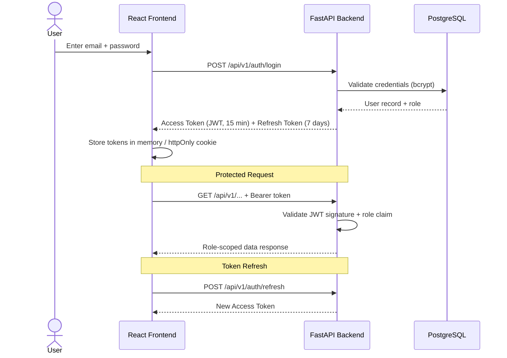
```mermaid
sequenceDiagram
    actor User
    participant UI as React Frontend
    participant API as FastAPI Backend
    participant DB as PostgreSQL

    User->>UI: Enter email + password
    UI->>API: POST /api/v1/auth/login
    API->>DB: Validate credentials (bcrypt)
    DB-->>API: User record + role
    API-->>UI: Access Token (JWT, 15 min) + Refresh Token (7 days)
    UI->>UI: Store tokens in memory / httpOnly cookie

    Note over UI,API: Protected Request
    UI->>API: GET /api/v1/... + Bearer token
    API->>API: Validate JWT signature + role claim
    API-->>UI: Role-scoped data response

    Note over UI,API: Token Refresh
    UI->>API: POST /api/v1/auth/refresh
    API-->>UI: New Access Token
```

---

## 4. Teaching Session Lifecycle

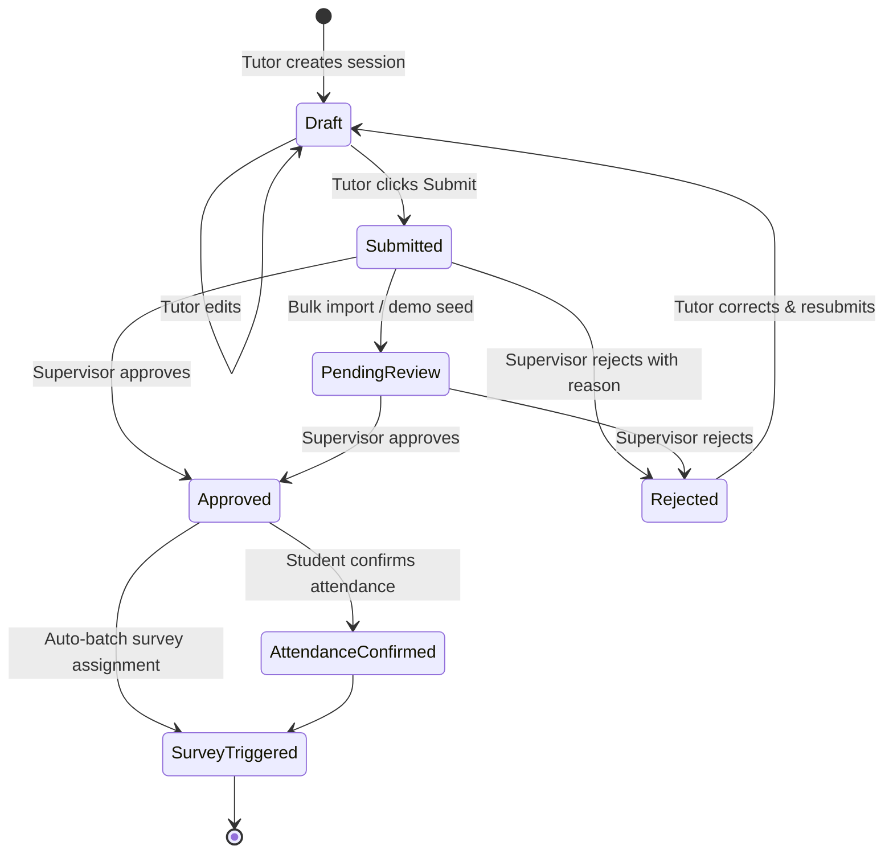
```mermaid
stateDiagram-v2
    [*] --> Draft : Tutor creates session

    Draft --> Draft : Tutor edits
    Draft --> Submitted : Tutor clicks Submit

    Submitted --> PendingReview : Bulk import / demo seed
    Submitted --> Approved : Supervisor approves
    Submitted --> Rejected : Supervisor rejects with reason

    PendingReview --> Approved : Supervisor approves
    PendingReview --> Rejected : Supervisor rejects

    Rejected --> Draft : Tutor corrects & resubmits

    Approved --> AttendanceConfirmed : Student confirms attendance
    Approved --> SurveyTriggered : Auto-batch survey assignment

    AttendanceConfirmed --> SurveyTriggered
    SurveyTriggered --> [*]
```

---

## 5. Teaching Session — Role Interaction Flow

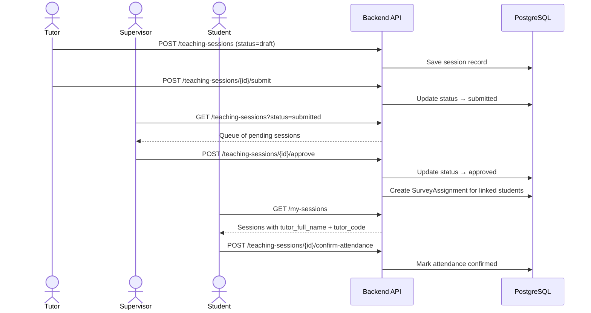
```mermaid
sequenceDiagram
    actor Tutor
    actor Supervisor
    actor Student
    participant API as Backend API
    participant DB as PostgreSQL

    Tutor->>API: POST /teaching-sessions (status=draft)
    API->>DB: Save session record
    Tutor->>API: POST /teaching-sessions/{id}/submit
    API->>DB: Update status → submitted

    Supervisor->>API: GET /teaching-sessions?status=submitted
    API-->>Supervisor: Queue of pending sessions

    Supervisor->>API: POST /teaching-sessions/{id}/approve
    API->>DB: Update status → approved
    API->>DB: Create SurveyAssignment for linked students

    Student->>API: GET /my-sessions
    API-->>Student: Sessions with tutor_full_name + tutor_code

    Student->>API: POST /teaching-sessions/{id}/confirm-attendance
    API->>DB: Mark attendance confirmed
```

---

## 6. Survey & Feedback Workflow

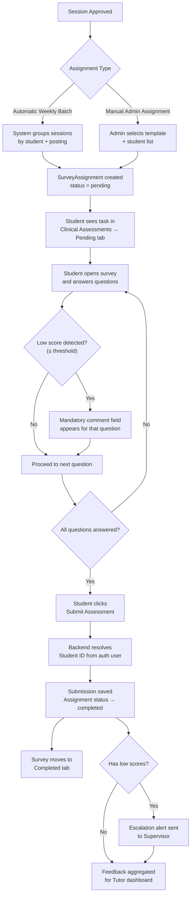
```mermaid
flowchart TD
    A["Session Approved"] --> B{"Assignment Type"}

    B -->|Automatic Weekly Batch| C["System groups sessions\nby student + posting"]
    B -->|Manual Admin Assignment| D["Admin selects template\n+ student list"]

    C --> E["SurveyAssignment created\nstatus = pending"]
    D --> E

    E --> F["Student sees task in\nClinical Assessments → Pending tab"]
    F --> G["Student opens survey\nand answers questions"]

    G --> H{"Low score detected?\n(≤ threshold)"}
    H -->|Yes| I["Mandatory comment field\nappears for that question"]
    H -->|No| J["Proceed to next question"]
    I --> J

    J --> K{"All questions answered?"}
    K -->|No| G
    K -->|Yes| L["Student clicks\nSubmit Assessment"]

    L --> M["Backend resolves\nStudent ID from auth user"]
    M --> N["Submission saved\nAssignment status → completed"]

    N --> O["Survey moves to\nCompleted tab"]
    N --> P{"Has low scores?"}
    P -->|Yes| Q["Escalation alert sent\nto Supervisor"]
    P -->|No| R["Feedback aggregated\nfor Tutor dashboard"]
    Q --> R
```

---

## 7. Student Lifecycle

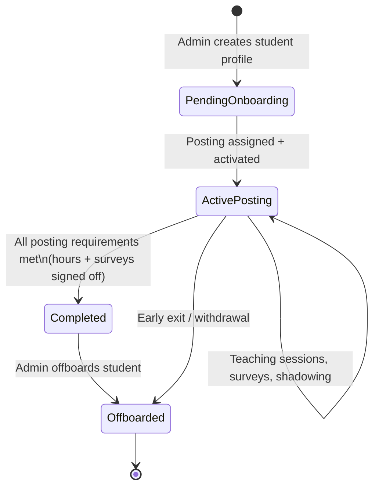
```mermaid
stateDiagram-v2
    [*] --> PendingOnboarding : Admin creates student profile

    PendingOnboarding --> ActivePosting : Posting assigned + activated

    ActivePosting --> ActivePosting : Teaching sessions, surveys, shadowing

    ActivePosting --> Completed : All posting requirements met\n(hours + surveys signed off)

    Completed --> Offboarded : Admin offboards student

    ActivePosting --> Offboarded : Early exit / withdrawal

    Offboarded --> [*]
```

---

## 8. Shadowing Application Flow

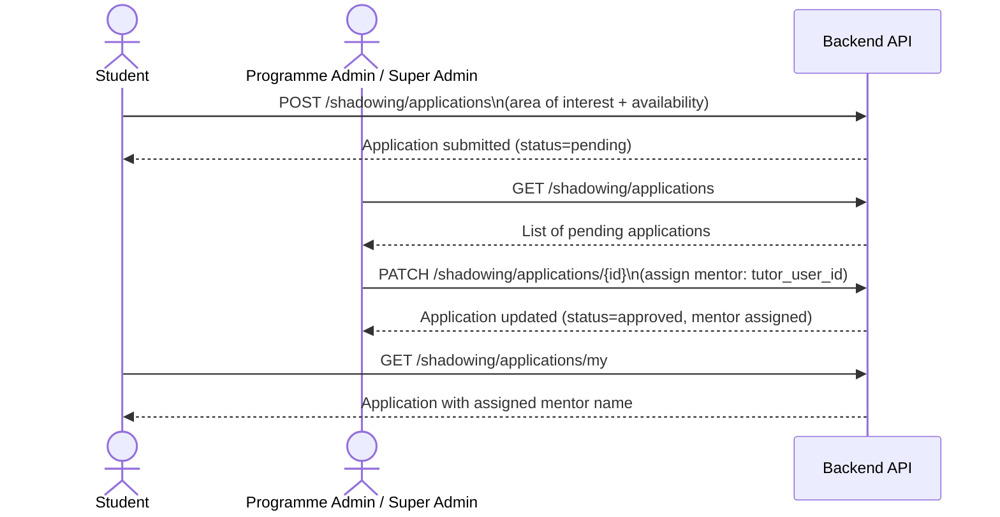
```mermaid
sequenceDiagram
    actor Student
    actor Admin as Programme Admin / Super Admin
    participant API as Backend API

    Student->>API: POST /shadowing/applications\n(area of interest + availability)
    API-->>Student: Application submitted (status=pending)

    Admin->>API: GET /shadowing/applications
    API-->>Admin: List of pending applications

    Admin->>API: PATCH /shadowing/applications/{id}\n(assign mentor: tutor_user_id)
    API-->>Admin: Application updated (status=approved, mentor assigned)

    Student->>API: GET /shadowing/applications/my
    API-->>Student: Application with assigned mentor name
```

---

## 9. AI Help (RAG) Pipeline

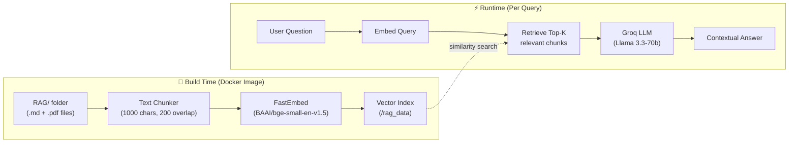
```mermaid
flowchart LR
    subgraph BuildTime["🔨 Build Time (Docker Image)"]
        Docs["RAG/ folder\n(.md + .pdf files)"]
        Chunker["Text Chunker\n(1000 chars, 200 overlap)"]
        Embedder["FastEmbed\n(BAAI/bge-small-en-v1.5)"]
        Index["Vector Index\n(/rag_data)"]

        Docs --> Chunker --> Embedder --> Index
    end

    subgraph Runtime["⚡ Runtime (Per Query)"]
        Question["User Question"]
        EmbedQ["Embed Query"]
        Retrieve["Retrieve Top-K\nrelevant chunks"]
        LLM["Groq LLM\n(Llama 3.3-70b)"]
        Answer["Contextual Answer"]

        Question --> EmbedQ --> Retrieve
        Index -.->|similarity search| Retrieve
        Retrieve --> LLM --> Answer
    end
```

---

## 10. Notification Flow

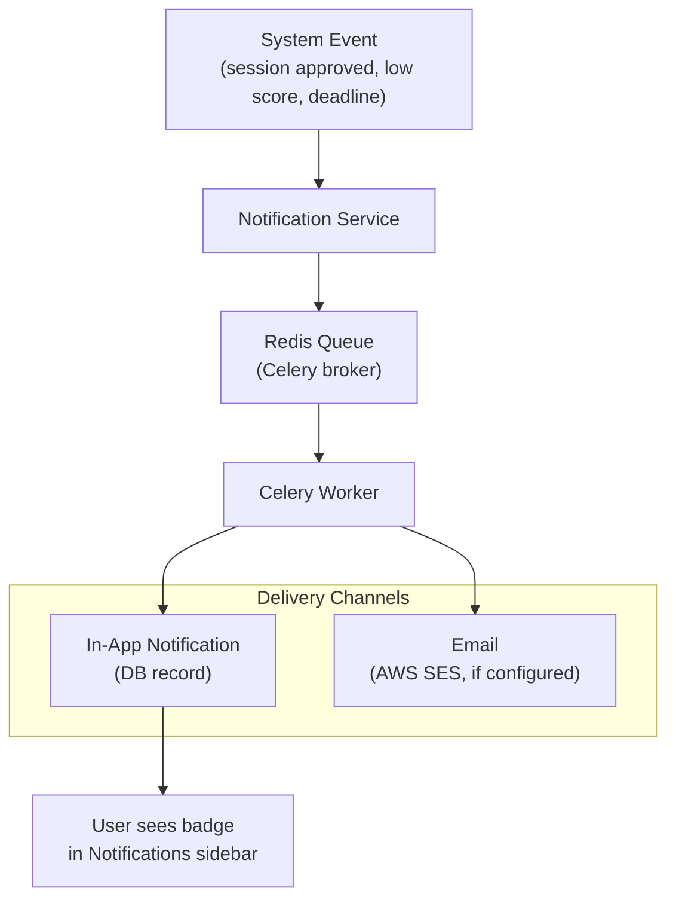
```mermaid
flowchart TD
    Trigger["System Event\n(session approved, low score, deadline)"]
    Service["Notification Service"]
    Redis["Redis Queue\n(Celery broker)"]
    Worker["Celery Worker"]

    subgraph Channels["Delivery Channels"]
        InApp["In-App Notification\n(DB record)"]
        Email["Email\n(AWS SES, if configured)"]
    end

    User["User sees badge\nin Notifications sidebar"]

    Trigger --> Service --> Redis --> Worker
    Worker --> InApp & Email
    InApp --> User
```

---

## 11. End-to-End Data Flow Summary

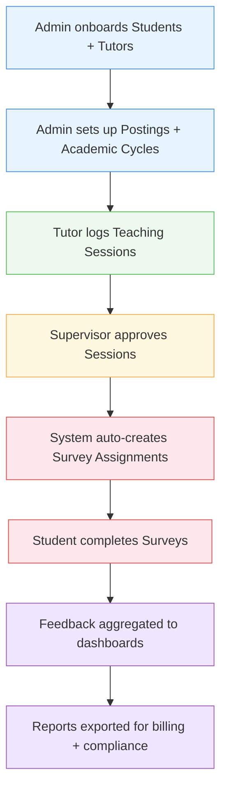
```mermaid
flowchart TD
    A["Admin onboards Students + Tutors"]
    B["Admin sets up Postings + Academic Cycles"]
    C["Tutor logs Teaching Sessions"]
    D["Supervisor approves Sessions"]
    E["System auto-creates Survey Assignments"]
    F["Student completes Surveys"]
    G["Feedback aggregated to dashboards"]
    H["Reports exported for billing + compliance"]

    A --> B --> C --> D --> E --> F --> G --> H

    style A fill:#e8f4fd,stroke:#4a90d9
    style B fill:#e8f4fd,stroke:#4a90d9
    style C fill:#edf9ee,stroke:#5cb85c
    style D fill:#fff8e1,stroke:#f0ad4e
    style E fill:#fce8ec,stroke:#d9534f
    style F fill:#fce8ec,stroke:#d9534f
    style G fill:#f0e6ff,stroke:#9b59b6
    style H fill:#f0e6ff,stroke:#9b59b6
```

---

---

# Low-Level Implementation Flows

> These diagrams detail internal data models, specific API endpoints, middleware chains, and component-level interactions derived directly from the source code.

---

## L1. Database Entity Relationship Diagram (ERD)

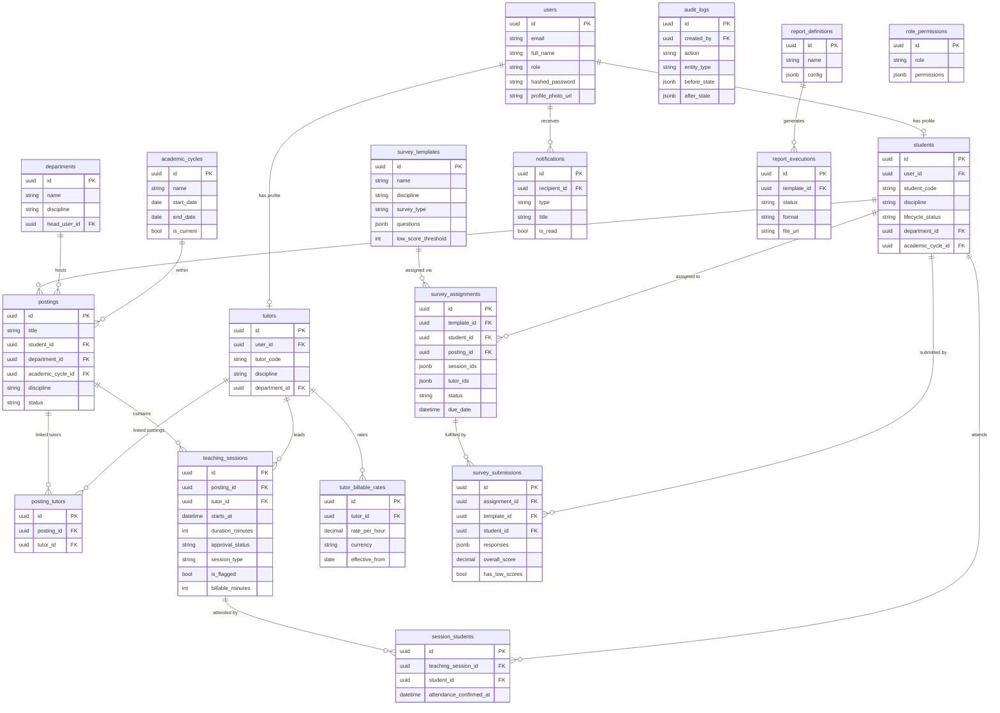
```mermaid
erDiagram
    users {
        uuid id PK
        string email
        string full_name
        string role
        string hashed_password
        string profile_photo_url
    }
    students {
        uuid id PK
        uuid user_id FK
        string student_code
        string discipline
        string lifecycle_status
        uuid department_id FK
        uuid academic_cycle_id FK
    }
    tutors {
        uuid id PK
        uuid user_id FK
        string tutor_code
        string discipline
        uuid department_id FK
    }
    departments {
        uuid id PK
        string name
        string discipline
        uuid head_user_id FK
    }
    academic_cycles {
        uuid id PK
        string name
        date start_date
        date end_date
        bool is_current
    }
    postings {
        uuid id PK
        string title
        uuid student_id FK
        uuid department_id FK
        uuid academic_cycle_id FK
        string discipline
        string status
    }
    posting_tutors {
        uuid id PK
        uuid posting_id FK
        uuid tutor_id FK
    }
    teaching_sessions {
        uuid id PK
        uuid posting_id FK
        uuid tutor_id FK
        datetime starts_at
        int duration_minutes
        string approval_status
        string session_type
        bool is_flagged
        int billable_minutes
    }
    session_students {
        uuid id PK
        uuid teaching_session_id FK
        uuid student_id FK
        datetime attendance_confirmed_at
    }
    tutor_billable_rates {
        uuid id PK
        uuid tutor_id FK
        decimal rate_per_hour
        string currency
        date effective_from
    }
    survey_templates {
        uuid id PK
        string name
        string discipline
        string survey_type
        jsonb questions
        int low_score_threshold
    }
    survey_assignments {
        uuid id PK
        uuid template_id FK
        uuid student_id FK
        uuid posting_id FK
        jsonb session_ids
        jsonb tutor_ids
        string status
        datetime due_date
    }
    survey_submissions {
        uuid id PK
        uuid assignment_id FK
        uuid template_id FK
        uuid student_id FK
        jsonb responses
        decimal overall_score
        bool has_low_scores
    }
    notifications {
        uuid id PK
        uuid recipient_id FK
        string type
        string title
        bool is_read
    }
    audit_logs {
        uuid id PK
        uuid created_by FK
        string action
        string entity_type
        jsonb before_state
        jsonb after_state
    }
    report_definitions {
        uuid id PK
        string name
        jsonb config
    }
    report_executions {
        uuid id PK
        uuid template_id FK
        string status
        string format
        string file_url
    }
    role_permissions {
        uuid id PK
        string role
        jsonb permissions
    }

    users ||--o| students : "has profile"
    users ||--o| tutors : "has profile"
    students ||--o{ postings : "assigned to"
    departments ||--o{ postings : "hosts"
    academic_cycles ||--o{ postings : "within"
    postings ||--o{ posting_tutors : "linked tutors"
    tutors ||--o{ posting_tutors : "linked postings"
    postings ||--o{ teaching_sessions : "contains"
    tutors ||--o{ teaching_sessions : "leads"
    teaching_sessions ||--o{ session_students : "attended by"
    students ||--o{ session_students : "attends"
    tutors ||--o{ tutor_billable_rates : "rates"
    survey_templates ||--o{ survey_assignments : "assigned via"
    students ||--o{ survey_assignments : "assigned to"
    survey_assignments ||--o{ survey_submissions : "fulfilled by"
    students ||--o{ survey_submissions : "submitted by"
    users ||--o{ notifications : "receives"
    report_definitions ||--o{ report_executions : "generates"
```

---

## L2. Complete API Endpoint Surface

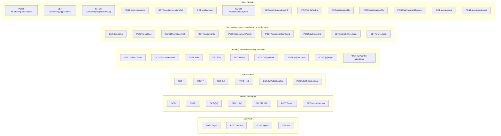
```mermaid
graph LR
    subgraph Auth["Auth  /auth"]
        A1["POST /login"]
        A2["POST /refresh"]
        A3["POST /logout"]
        A4["GET /me"]
    end

    subgraph StudentsAPI["Students  /students"]
        S1["GET /"]
        S2["POST /"]
        S3["GET /{id}"]
        S4["PATCH /{id}"]
        S5["DELETE /{id}"]
        S6["POST /import"]
        S7["GET /import/batches"]
    end

    subgraph TutorsAPI["Tutors  /tutors"]
        T1["GET /"]
        T2["POST /"]
        T3["GET /{id}"]
        T4["PATCH /{id}"]
        T5["GET /{id}/billable-rates"]
        T6["POST /{id}/billable-rates"]
    end

    subgraph SessionsAPI["Teaching Sessions  /teaching-sessions"]
        TS1["GET / — list + filters"]
        TS2["POST / — create draft"]
        TS3["POST /bulk"]
        TS4["GET /{id}"]
        TS5["PATCH /{id}"]
        TS6["POST /{id}/submit"]
        TS7["POST /{id}/approve"]
        TS8["POST /{id}/reject"]
        TS9["POST /{id}/confirm-attendance"]
    end

    subgraph SurveysAPI["Surveys  /surveys + /submissions + /assignments"]
        SV1["GET /templates"]
        SV2["POST /templates"]
        SV3["PATCH /templates/{id}"]
        SV4["GET /assignments"]
        SV5["POST /assignments/batch"]
        SV6["POST /assignments/manual"]
        SV7["POST /submissions"]
        SV8["GET /tutors/{id}/feedback"]
        SV9["GET /my/feedback"]
    end

    subgraph OtherAPI["Other Modules"]
        O1["POST /shadowing/applications"]
        O2["GET /shadowing/applications"]
        O3["PATCH /shadowing/applications/{id}"]
        O4["POST /reports/execute"]
        O5["GET /reports/executions/{id}"]
        O6["GET /notifications"]
        O7["PATCH /notifications/{id}/read"]
        O8["GET /analytics/dashboard"]
        O9["POST /ai-help/chat"]
        O10["GET /settings/profile"]
        O11["PATCH /settings/profile"]
        O12["POST /settings/profile/photo"]
        O13["GET /admin/users"]
        O14["POST /admin/broadcast"]
    end
```

---

## L3. RBAC Middleware Enforcement Chain

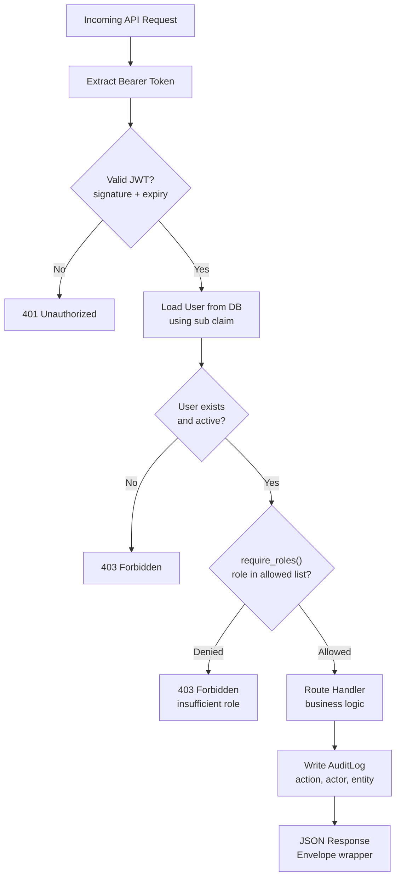
```mermaid
flowchart TD
    Request["Incoming API Request"]
    Extract["Extract Bearer Token"]
    ValidateJWT{"Valid JWT?\nsignature + expiry"}
    Reject401["401 Unauthorized"]
    LoadUser["Load User from DB\nusing sub claim"]
    UserActive{"User exists\nand active?"}
    Reject403a["403 Forbidden"]
    CheckRole{"require_roles()\nrole in allowed list?"}
    Reject403b["403 Forbidden\ninsufficient role"]
    Handler["Route Handler\nbusiness logic"]
    AuditLog["Write AuditLog\naction, actor, entity"]
    Response["JSON Response\nEnvelope wrapper"]

    Request --> Extract --> ValidateJWT
    ValidateJWT -->|No| Reject401
    ValidateJWT -->|Yes| LoadUser --> UserActive
    UserActive -->|No| Reject403a
    UserActive -->|Yes| CheckRole
    CheckRole -->|Denied| Reject403b
    CheckRole -->|Allowed| Handler --> AuditLog --> Response
```

---

## L4. Frontend Routing & Component Map

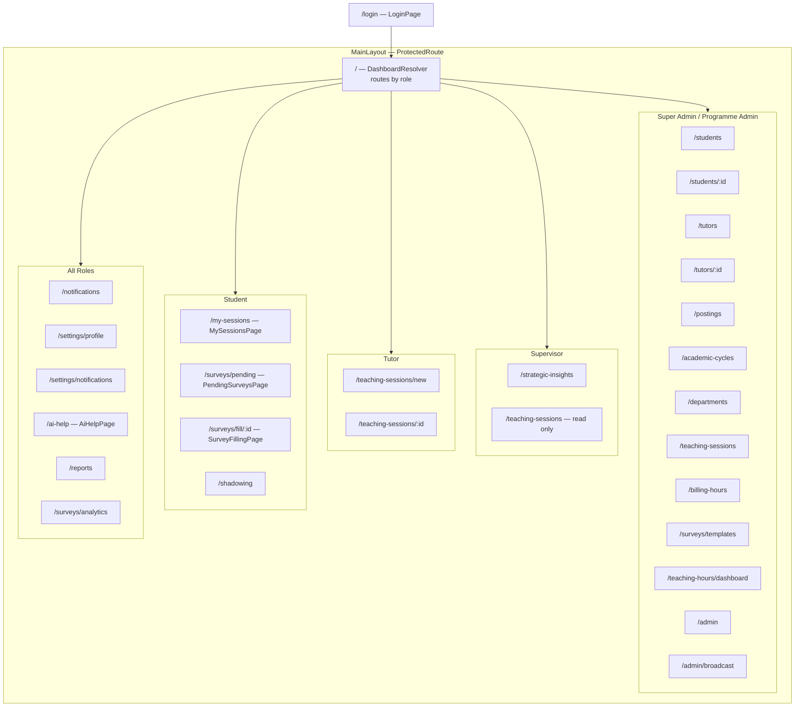
```mermaid
graph TD
    Login["/login — LoginPage"]

    subgraph MainLayout["MainLayout — ProtectedRoute"]
        Root["/ — DashboardResolver\nroutes by role"]

        subgraph Admin["Super Admin / Programme Admin"]
            R1["/students"]
            R2["/students/:id"]
            R3["/tutors"]
            R4["/tutors/:id"]
            R5["/postings"]
            R6["/academic-cycles"]
            R7["/departments"]
            R8["/teaching-sessions"]
            R9["/billing-hours"]
            R10["/surveys/templates"]
            R11["/teaching-hours/dashboard"]
            R12["/admin"]
            R13["/admin/broadcast"]
        end

        subgraph Supervisor["Supervisor"]
            R14["/strategic-insights"]
            R15["/teaching-sessions — read only"]
        end

        subgraph Tutor["Tutor"]
            R16["/teaching-sessions/new"]
            R17["/teaching-sessions/:id"]
        end

        subgraph Student["Student"]
            R18["/my-sessions — MySessionsPage"]
            R19["/surveys/pending — PendingSurveysPage"]
            R20["/surveys/fill/:id — SurveyFillingPage"]
            R21["/shadowing"]
        end

        subgraph Shared["All Roles"]
            R22["/notifications"]
            R23["/settings/profile"]
            R24["/settings/notifications"]
            R25["/ai-help — AiHelpPage"]
            R26["/reports"]
            R27["/surveys/analytics"]
        end
    end

    Login --> Root
    Root --> Admin & Supervisor & Tutor & Student & Shared
```

---

## L5. Internal API Request Pipeline

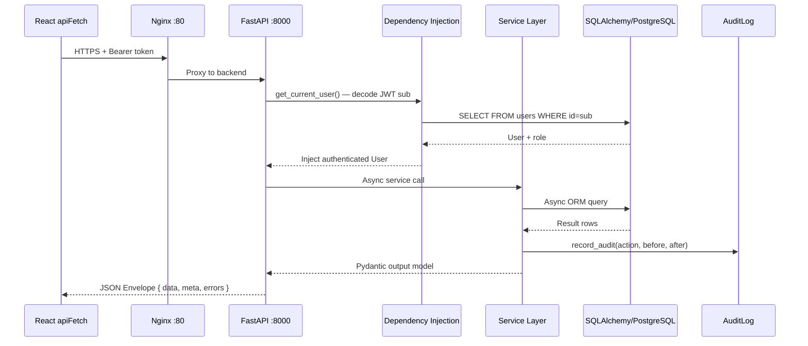
```mermaid
sequenceDiagram
    participant FE as React apiFetch
    participant Nginx as Nginx :80
    participant API as FastAPI :8000
    participant Deps as Dependency Injection
    participant Svc as Service Layer
    participant DB as SQLAlchemy/PostgreSQL
    participant Audit as AuditLog

    FE->>Nginx: HTTPS + Bearer token
    Nginx->>API: Proxy to backend
    API->>Deps: get_current_user() — decode JWT sub
    Deps->>DB: SELECT FROM users WHERE id=sub
    DB-->>Deps: User + role
    Deps-->>API: Inject authenticated User
    API->>Svc: Async service call
    Svc->>DB: Async ORM query
    DB-->>Svc: Result rows
    Svc->>Audit: record_audit(action, before, after)
    Svc-->>API: Pydantic output model
    API-->>FE: JSON Envelope { data, meta, errors }
```

---

## L6. Bulk CSV Student Import Flow

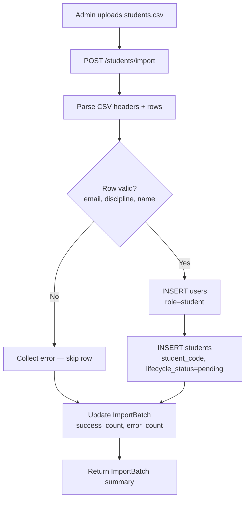
```mermaid
flowchart TD
    Upload["Admin uploads students.csv"]
    Endpoint["POST /students/import"]
    Parse["Parse CSV headers + rows"]
    Validate{"Row valid?\nemail, discipline, name"}
    Error["Collect error — skip row"]
    CreateUser["INSERT users\nrole=student"]
    CreateStudent["INSERT students\nstudent_code, lifecycle_status=pending"]
    Batch["Update ImportBatch\nsuccess_count, error_count"]
    Return["Return ImportBatch summary"]

    Upload --> Endpoint --> Parse --> Validate
    Validate -->|No| Error --> Batch
    Validate -->|Yes| CreateUser --> CreateStudent --> Batch
    Batch --> Return
```

---

## L7. Async Report Generation Flow

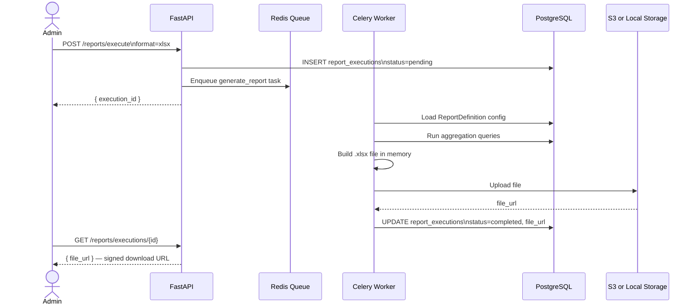
```mermaid
sequenceDiagram
    actor Admin
    participant API as FastAPI
    participant Redis as Redis Queue
    participant Celery as Celery Worker
    participant DB as PostgreSQL
    participant FS as S3 or Local Storage

    Admin->>API: POST /reports/execute\nformat=xlsx
    API->>DB: INSERT report_executions\nstatus=pending
    API->>Redis: Enqueue generate_report task
    API-->>Admin: { execution_id }

    Celery->>DB: Load ReportDefinition config
    Celery->>DB: Run aggregation queries
    Celery->>Celery: Build .xlsx file in memory
    Celery->>FS: Upload file
    FS-->>Celery: file_url
    Celery->>DB: UPDATE report_executions\nstatus=completed, file_url

    Admin->>API: GET /reports/executions/{id}
    API-->>Admin: { file_url } — signed download URL
```

---

## L8. Survey Score Calculation & Low-Score Alert

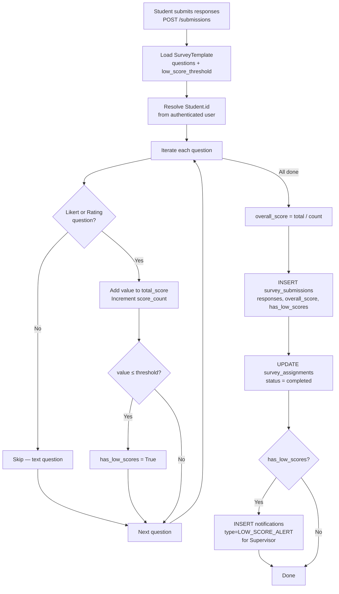
```mermaid
flowchart TD
    Submit["Student submits responses\nPOST /submissions"]
    LoadTemplate["Load SurveyTemplate\nquestions + low_score_threshold"]
    ResolveStu["Resolve Student.id\nfrom authenticated user"]
    Loop["Iterate each question"]
    IsNumeric{"Likert or Rating\nquestion?"}
    Skip["Skip — text question"]
    AddScore["Add value to total_score\nIncrement score_count"]
    LowCheck{"value ≤ threshold?"}
    SetFlag["has_low_scores = True"]
    Next["Next question"]
    CalcAvg["overall_score = total / count"]
    SaveSub["INSERT survey_submissions\nresponses, overall_score, has_low_scores"]
    MarkDone["UPDATE survey_assignments\nstatus = completed"]
    AlertCheck{"has_low_scores?"}
    Notify["INSERT notifications\ntype=LOW_SCORE_ALERT\nfor Supervisor"]
    Done["Done"]

    Submit --> LoadTemplate --> ResolveStu --> Loop --> IsNumeric
    IsNumeric -->|No| Skip --> Next
    IsNumeric -->|Yes| AddScore --> LowCheck
    LowCheck -->|Yes| SetFlag --> Next
    LowCheck -->|No| Next --> Loop
    Loop -->|All done| CalcAvg --> SaveSub --> MarkDone --> AlertCheck
    AlertCheck -->|Yes| Notify --> Done
    AlertCheck -->|No| Done
```

---

## L9. Profile Photo Upload Flow

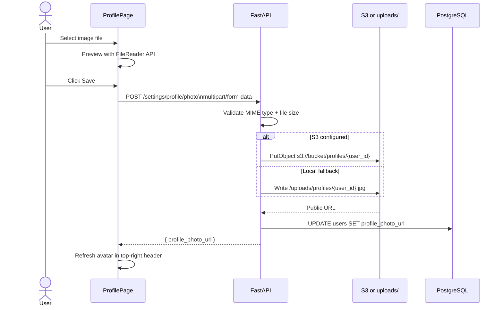
```mermaid
sequenceDiagram
    actor User
    participant UI as ProfilePage
    participant API as FastAPI
    participant Store as S3 or uploads/
    participant DB as PostgreSQL

    User->>UI: Select image file
    UI->>UI: Preview with FileReader API
    User->>UI: Click Save
    UI->>API: POST /settings/profile/photo\nmultipart/form-data
    API->>API: Validate MIME type + file size
    alt S3 configured
        API->>Store: PutObject s3://bucket/profiles/{user_id}
    else Local fallback
        API->>Store: Write /uploads/profiles/{user_id}.jpg
    end
    Store-->>API: Public URL
    API->>DB: UPDATE users SET profile_photo_url
    API-->>UI: { profile_photo_url }
    UI->>UI: Refresh avatar in top-right header
```
